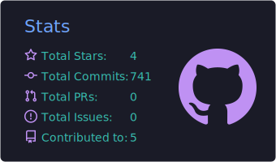
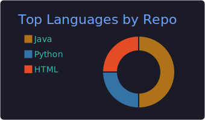

  
  
  
  

---

Backend software engineer with 3+ years building distributed, high-availability systems in production. Currently at Codelark LLC contracted to Ford Motor Company — shipping cloud-native Java services on AWS. M.S. Computer Science from the University of Colorado Denver (GPA 3.65).

I focus on the backend: API design, event-driven architecture with Kafka, database performance, and keeping services reliable under load. Four cloud certifications (AWS Solutions Architect, Developer, Cloud Practitioner + Azure Fundamentals) and staying sharp on LeetCode.

---

## Tech Stack

| Area | Tools |
|---|---|
| **Languages** | Java · Python · JavaScript · SQL · C++ · C |
| **Backend** | Spring Boot · Spring Security · Hibernate · JPA · Kafka · gRPC · REST APIs |
| **Cloud & Infra** | AWS (EC2, S3, RDS, Lambda, EKS, IAM) · Docker · Kubernetes · Terraform |
| **Databases** | PostgreSQL · MySQL · MongoDB · DynamoDB · Redis |
| **CI/CD & Tooling** | GitHub Actions · Jenkins · Maven · Gradle · Git |
| **Observability** | OpenTelemetry · Prometheus · Grafana · Distributed Tracing |

---

## Projects

| Project | Description | Stack |
|---|---|---|
| [Intelligent Cloud Operations Platform](https://github.com/VineshReddyK/Intelligent-cloud-operations-platform) | Distributed microservices platform with Kafka event streaming, DJL anomaly detection, custom Kubernetes operator (CRD), and full observability — Prometheus, Grafana, Loki, Tempo | Java 21, Spring Boot 3.5, Kafka, PostgreSQL, Kubernetes |
| [Banking REST API System](https://github.com/VineshReddyK/banking-rest-api-system) | Production-grade banking APIs — account management, transactions, JWT auth, Spring Security, Swagger docs. 15% query response improvement from SQL optimization | Java, Spring Boot, Hibernate, MySQL, JWT |
| [DDoS Attack Detection](https://github.com/VineshReddyK/DDOS-Attack-Detection) | Ensemble ML classifier (Random Forest, CNN-LSTM, ANN, K-Means) for real-time network traffic analysis. Reduced simulated attack impact by 30% via early anomaly flagging | Python, TensorFlow, scikit-learn, FastAPI, Docker |

---

## Certifications

- AWS Certified Solutions Architect – Associate &nbsp;·&nbsp; Jun 2024 – Jun 2027
- AWS Certified Developer – Associate &nbsp;·&nbsp; May 2024 – May 2027
- AWS Certified Cloud Practitioner &nbsp;·&nbsp; 2024
- Microsoft Certified: Azure Fundamentals (AZ-900) &nbsp;·&nbsp; Apr 2024

---

## GitHub Stats

---

  <a href="https://vineshreddyk.github.io">vineshreddyk.github.io</a> &nbsp;·&nbsp; <a href="mailto:vineshreddyy.k@gmail.com">vineshreddyy.k@gmail.com</a>

